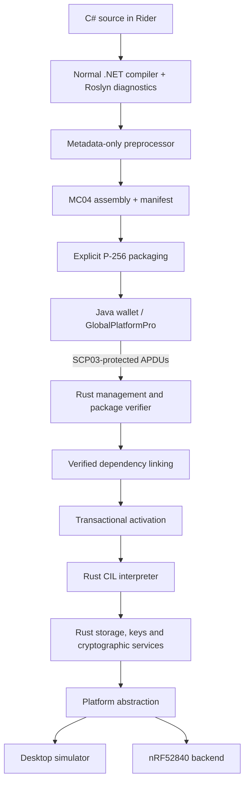
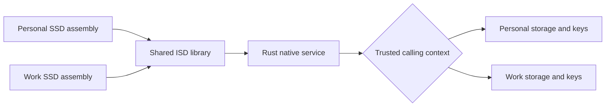
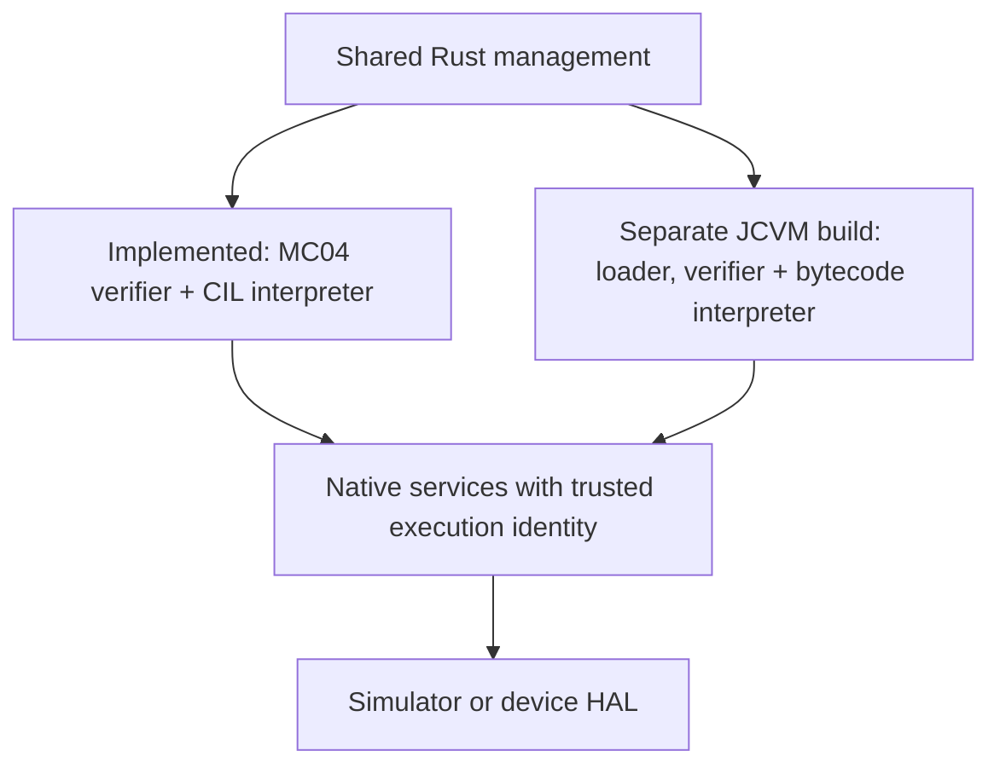

# MicroCard architecture

MicroCard is a programmable smart-card runtime. Managed assemblies express credential behavior. Rust controls execution, authorization, cryptographic keys and persistent state. The same portable Rust core runs in a desktop simulator and in bare-metal nRF52840 firmware.

This document explains responsibilities and trust boundaries. Start with the [README](../README.md) for setup. Exact encodings and supported instructions belong in the [assembly format](ASSEMBLY_FORMAT.md), [execution profile](PROFILE.md) and [protocol](PROTOCOL.md) references.

## Implementation status

The .NET build pipeline, reduced CIL interpreter, signed loading, security domains, native services, simulator, and Java release wallet are implemented. The nRF52840 backend has development hardware evidence, with additional acceptance work outstanding.

**The Java Card VM is implemented in `crates/microcard-engine-jcvm` and runs a real applet in the simulator.** It reads a CAP container, verifies a whole package structurally at load, and interprets Java Card bytecode against an object heap with firewall checks. OpenFIPS201 installs, registers, accepts a SELECT and answers PIV commands. This is a working engine with named gaps rather than a compliant Java Card implementation, and it makes no Java Card compliance claim. [The Java Card profile](JCVM_PROFILE.md) records what each part does, what the target is, and what is still missing. Separate MC04 and JCVM board profiles cross-link; the current JCVM build has not yet been validated on physical hardware.

## Four responsibilities

| Component | Responsibility | Runs where |
|---|---|---|
| Rust runtime | Verify and execute code. Enforce domains, quotas and transactions. Own cryptographic services and storage | Simulator and device |
| .NET tooling | Analyze C#, reduce supported CIL, resolve metadata and produce signed packages | Developer's computer |
| Managed assemblies | Implement credential behavior and reusable library functions through bounded framework APIs | Rust interpreter |
| Java wallet | Drive enrollment and demonstrations. Use GlobalPlatformPro for SCP03. Verify returned signatures | User's computer |

## What Rust owns

`microcard-core` is the portable security boundary. It parses bounded APDUs and packages, verifies signatures, validates executable metadata and CIL, resolves dependencies, and interprets the supported instruction set. It also implements ISD/SSD management, SCP03 on the card side, transactional journals, domain stores, opaque key handles and native-call authorization.

The interpreter does not delegate memory safety to a package signature. A correctly signed assembly still has to pass structural and type verification. Calls must resolve to verified managed targets or pinned native services. Execution has bounded instruction, stack, frame, allocation and native-work budgets. Faults terminate the invocation and abort ordinary pending writes.

Persistent credential retry counters are a deliberate exception to ordinary rollback: a failed PIN attempt must not become free because later managed code faults. Retry-floor persistence is enforced below managed execution.

The simulator supplies files, process I/O, host entropy and software cryptography through platform interfaces. The nRF52840 backend supplies UART, flash, hardware entropy, time, watchdog and logical GPIO. Board profiles default to hardware-only CC310 providers; host and explicit reference builds use software cryptography. Physical CC310 validation remains outstanding. USB CCID has enumerated and carried secure messaging on the DK, with abort timing, disconnect and sustained throughput outstanding.

The managed-code boundary assumes trusted Rust firmware. Resistance to attackers with debug access requires the production controls in [hardware results](HARDWARE_SMOKE.md) and [board requirements](BOARD_PORT_CHECKLIST.md).

## What .NET owns

The desktop compiler creates ordinary .NET assemblies. Roslyn analyzers provide early diagnostics in Rider and builds, including unsupported language features, invalid lifecycle declarations, unsafe transaction effects and resource limits. Analyzers improve feedback. Disabling them cannot authorize device execution.

The preprocessor reads metadata and CIL without executing the input assembly. It validates the supported reachable program, retains compact ECMA-335-style tables, tokens, signatures and CIL, and emits MC04. Unneeded desktop structures are removed. MC04 defines a reduced .NET execution profile with its own runtime.

Signing is an explicit host step. The signature covers the executable image and its manifest, including target domain and incarnation, identity, version, dependencies, capabilities and limits. Signing private keys do not belong on the card.

Two kinds of managed code participate at execution time:

- **Application assemblies** provide annotated lifecycle handlers and credential behavior.
- **Shared library assemblies** provide reusable operations such as encoding and typed cryptographic facades. Their managed instructions execute in the same bounded interpreter.

Only the authenticated framework can introduce native bindings. A namespace, a lookalike attribute, or an application signature does not confer native privilege. Framework cryptographic facades invoke Rust services. They leave AES and elliptic-curve private-key arithmetic to native code.

## Ownership, dependencies and execution identity

The factory-empty ISD has no signing identity. Its first successful assembly activation must be `mscorlib`. Activation atomically pins that signer and establishes ownership. SSD creation is gated on this step. ISD ownership has no reset or unbind operation.

Each SSD pins its signer on its first successful load. Assemblies in that SSD share application storage, subject to declared schemas and quotas. Other SSDs cannot select that storage by supplying a domain name. Framework credentials and private keys occupy protected service stores rather than application key/value records.

Dependencies must already be active. Consumers can request same-SSD or ISD dependencies, with version and signer constraints. Providers can restrict permitted consumers. Activation checks both directions and records the exact provider package digest and method target. Recovery revalidates those links.

An SSD calling an ISD library retains the calling SSD's storage and key identity. The library's location does not grant its caller access to ISD secrets. ISD-origin execution uses ISD storage, which is not directly exposed to SSD callers. Cross-SSD calls and shared managed references are disallowed.

Deleting an SSD revokes its registrations, handles and namespace. Recreating its identifier produces a new incarnation, so old packages cannot simply be replayed. Logical deletion is distinct from physical flash erasure.

These rules define the **MicroCard security-domain profile**. Full GlobalPlatform compliance remains outside its current scope.

## A command's path through the system

1. The Java client sends APDUs through a simulator or reader transport. GlobalPlatformPro supplies host SCP03 authentication, command protection and response verification.
2. Rust authenticates and decrypts the command. Management mutations require an authenticated session carrying a command MAC. Command encryption and response MAC remain the host's choice, because package signatures authorize the code itself.
3. For a load, Rust stages the complete package, checks its signature and executable structure, verifies dependencies and quotas, then activates it atomically. Partial uploads cannot execute.
4. For an invocation, Rust establishes trusted domain identity, resolves the selected instance and executes its verified entry point.
5. Managed code uses bounded framework calls. Rust checks ownership, arguments and work budgets before performing native operations.
6. Successful ordinary changes commit transactionally. The response returns through secure messaging. Host signature verification gives the wallet an independent check of the credential result.

A signature authorizes an assembly's identity. SCP03 authorizes management traffic. Neither replaces the other.

## Where the JCVM fits

The JCVM is a **second Rust execution engine** beside the CIL interpreter. Java Card source is compiled and converted on the host with the ordinary Java Card tooling. A format-specific loader and verifier validate Java Card executable content before activation. The device interprets Java Card bytecodes and never runs a desktop JVM.

The common services are transport, authenticated management, cryptographic providers, ownership-checked keys, persistent storage, quotas and the HAL. Java Card API adapters translate VM operations into those services. They must preserve Java Card object, firewall, transaction and lifecycle semantics. Compatibility cannot be achieved merely by renaming the .NET APIs.

[The Java Card profile](JCVM_PROFILE.md) defines the supported CAP and API subset.
Authenticated GlobalPlatform loading, installation, selection, and recovery reach the
engine through shared management. Immutable images and authenticated applet heap
snapshots use separate flash storage. Explicit transaction commits and PIN retry
changes checkpoint storage during execution; remaining durability gaps are tracked
in [release readiness](READINESS.md). Direct calls between engines are unsupported.

Board profiles select exactly one engine. The raw `serve-jcvm` host runner is volatile;
`serve-jcvm-managed` exercises authenticated loading and persistent recovery. Physical
execution of the current JCVM firmware remains a separate acceptance gate.

Image storage provides scoped range guards: nRF52840 and memory backends borrow
slot bytes, while the file backend owns the requested range. Multiple read guards
can coexist. `Descriptor::read_verified` checks geometry, length and the complete
image digest before returning a guard; callback reads use the same verification.
The provider borrow ends after verification. MC04 still
retains runtime image buffers until its execution graph uses these scoped reads.

MC04 domain internals separate application staging, lifecycle execution, metadata
mutations, snapshot encoding, and linking. `domains/linking.rs` owns dependency
resolution, executable-unit assembly, and whole-program call-graph validation;
`domains.rs` owns domain state, storage and recovery. `domains/management.rs` handles
authenticated management commands. `domains/execution.rs` owns selection,
invocation and execution transaction boundaries; `domains/native.rs` owns native
service dispatch, authorization and bounded output handling.

## Design references

- ECMA-335, Partition II: metadata. Partition III: CIL instructions. MicroCard's retained subset is specified in [MC04](ASSEMBLY_FORMAT.md).
- [Image verification](IMAGE_VERIFICATION.md) and [profile enforcement](PROFILE_ENFORCEMENT.md): independent host/device checks.
- [Domain policy](DOMAIN_POLICY.md), [storage](STORAGE.md), and [transactions](TRANSACTIONS.md): authority and persistence.
- [Native crypto providers](CRYPTO_PROVIDERS.md) and [HAL](NRF52840_HAL.md): platform responsibilities.
- [GlobalPlatform profile](GLOBALPLATFORM_PROFILE.md) and [reference provenance](REFERENCES.md): supported management behavior and standards editions.
